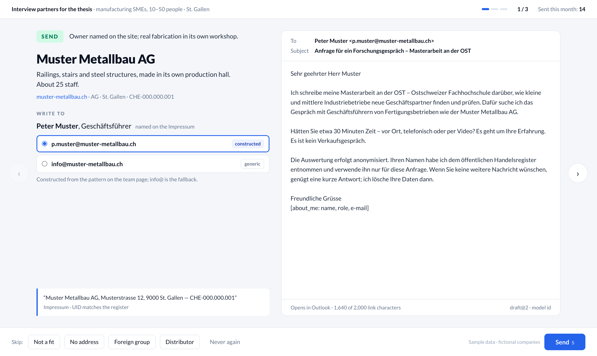

# company-reach

A small tool I am building for my master's thesis. I need people at small
Swiss companies to fill in a short survey, and finding the right company and
the right person by hand takes a long time. This tool does the searching and
drafts an invitation; I read each one and decide whether to send it.



## What it does

1. Lists the companies of a Swiss town from the public commercial register.
2. Picks the ones that fit my goal, using an AI model.
3. Finds each company's website and the person to write to.
4. Writes a short invitation in German.
5. Shows me one company at a time. I choose send or skip. It never sends mail
   by itself; "send" opens the draft in my own mail program.

## Status

All eight milestones are built: the pool and its scoring, the batch loop,
finding each company's site, reading it, choosing the contact and drafting
the invitation, the review page, and the privacy and publishing work. It has
not sent a real invitation yet — that waits for the survey to go live and for
the thesis's ethics approval, and the review page stays locked until both.

Each milestone was written with an AI coding assistant and explained to me
before I reviewed and merged it, so I learn how it works.

## Run it

Needs [uv](https://docs.astral.sh/uv/) (it installs Python 3.13 itself),
Docker for the search engine, and a language model: any OpenAI-compatible
endpoint.

```bash
git clone https://github.com/koray-kaya/company-reach.git
cd company-reach
uv sync
cp .env.example .env                  # model endpoint, key, model id
cp profile.toml.example profile.toml  # your goal, about you, the survey link

docker compose up -d searxng          # the search engine, on 127.0.0.1:8080
uv run company-reach doctor           # settings, prompts, database, endpoint
```

`profile.toml` has two sections the invitation is built from, and nothing is
drafted without them: `[sender]` (your name, your affiliation, the school's
short name) and `[invitation]` (the thesis topic, the survey's minutes, and
switches for every promise the mail may make — a closing date, the results
offer, no login, a reminder). Every switch is off until you set it: the mail
says only what you have confirmed. Pooling and scoring run without them;
`doctor` names what is missing.

When running with `uv run`, set `SEARXNG_URL=http://127.0.0.1:8080` in
`.env`; the container name only resolves inside Docker.

Then, for one town:

```bash
uv run company-reach pool --municipality 3203   # the register's companies, screened
uv run company-reach criteria                   # what your goal means, first
uv run company-reach score --limit 200          # rank them against the goal
uv run company-reach run                        # enrich a batch of ten
uv run company-reach review <run>               # decide, one company at a time
```

`3203` is the federal id of a municipality (that one is St. Gallen); `pool`
takes several (`--municipality 3203 --municipality 3443`, or `3203,3443`),
and `company-reach status` shows per municipality how many companies are
pooled, kept, scored, drawable, drawn, sent and waiting for a decision. `pool`
applies the rule-based exclusions as it stores each company; after the rules
change, `company-reach screen` applies them again to every company. Every
command is safe to run again: nothing already done is repeated, and scoring
is incremental. The criteria are written once per goal and stored, so every
`score` pass ranks against the rules `criteria` showed you;
`score --new-criteria` writes a fresh set and scores the pool again.

`run` finds each company's site, reads it, chooses who to write to and
drafts an invitation; a company whose search or site failed is recorded as
an error, not as "no website", and `company-reach retry <run>` does it
again. Every search query is logged, and a "no website" card on the review
page lists them; if they show search was throttled,
`company-reach retry <run> --no-site` redoes those companies too. A run
stops at its first batch with a sendable company; `run --target 10` draws on
until ten are sendable, the pool runs dry, or `MAX_BATCHES_PER_RUN` batches
(default 3) are drawn. To look at one company on its own:
`uv run company-reach enrich --uid CHE123456789 --until draft`.

`review` opens the page on `http://127.0.0.1:8000/`. It shows one company
per screen with the recommendation, the evidence, every address found and
the draft. The model writes one sentence of each mail; everything else is
written by code from the profile and the contact. You can switch the
salutation (Frau / Herr / none) or write to another of the addresses found,
and the mail is rebuilt without asking the model again. **Send** records the
decision and opens the draft in your own mail program — nothing is sent by
the tool. Send stays locked until `SENDING_APPROVED=true` is set in `.env`
and the profile's `survey_url` is real, and it refuses a draft that no
longer matches the profile or the contact. The page also runs in Docker:
`docker compose up -d app`.

When you change the profile after drafting — the survey link, a closing
date, the supervisor line — the cards say so, and one command brings them up
to date:

```bash
uv run company-reach redraft <run>              # rebuild the stale cards
```

It rebuilds each mail around its sentence without a model call, and asks the
model only for a sentence that fails its checks. Nothing is searched or
fetched again.

Every invitation's survey link carries the company's UID, so the survey's
answers can be counted without a second mail:

```bash
uv run company-reach responses import export.csv   # uid, started_at, completed_at
uv run company-reach report                        # counts per arm and kind
```

`report` prints sent, bounced, never, started and completed invitations per
frame, length arm (`[invitation] experiment`) and kind of contact, each rate
with its 95% interval. It prints counts only, no names.

## Personal data

The tool handles real people's names and addresses. [PRIVACY.md](PRIVACY.md)
says what it collects, where it keeps it and where it sends it — above all,
the model endpoint you choose receives the page text it reads. Two commands
delete: `company-reach forget <uid|email>` on request, and
`company-reach purge --older-than 365` for data nobody has touched for a
year.

## Tests

`uv run pytest` runs offline in about twenty seconds. The evaluations call
the real model and are opt-in: `RUN_LLM_EVALS=1 uv run pytest
tests/test_prompts.py -s`. They use my hand-labelled set in `data/golden/`
when it is there and a fictional subset committed in `tests/fixtures/`
otherwise, so they run from a fresh clone.

## Notes

- Built with Python, LangGraph, SearXNG, FastAPI and SQLite.
- Uses only public data: the Swiss commercial register (Zefix, via LINDAS) and
  the Swiss Official Gazette of Commerce (SHAB). See [NOTICE](NOTICE).
- The design, research notes and build plan are in [docs/](docs/) and
  [IMPLEMENTATION.md](IMPLEMENTATION.md).

MIT licence. Koray Kaya, 2026.
